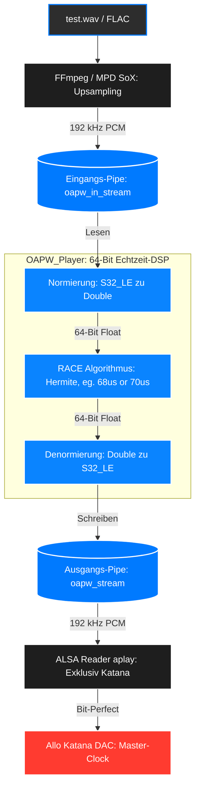

# OAPW_192k (High Fidelity Ambiophonics Audio Engine 192kHz/32Bit) - Version 16.0

**Entwickelt von:** Dr. Ulrich Thibaut
**Plattform:** C++17 / Cross-Plattform (Ideal geeignet: Raspberry Pi 5 mit DAC Hat Pro)

## Über das Projekt
OAPW ist eine hocheffiziente, block-basierte Echtzeit-Audio-Engine. Sie implementiert den "Recursive Ambiophonic Crosstalk Elimination" (RACE) Algorithmus nach Ralph Glasgal, um das akustische Übersprechen bei einer regulären Stereo-Lautsprecheraufstellung zu reduzieren und eine dreidimensionale, holografische Wiedergabe zu erzielen. Für bessere Effekte ist dabei eine relativ enge Lautsprecher-Aufstellung im Winkel von 10 bis 20° relativ zum Zuhörer ideal. 

Für eine kurze Einführung in die Ambiophonie als audiophile Wiedergabetechnik siehe die beiliegende README.txt sowie die dort zitierte Original-Literatur von Ralph Glasgal et al.

## Neue Version 16.0 mit 192kHz Samplingfrequenz und 32Bit Auflösung auf speziellen Wunsch
Die Architektur wurde über die vergangenen Versionen massiv ausgebaut. In der Version 16.0 werden Audiostreams mit einer Samplingfrequenz von 192.000 Hz in 32Bit Auflösung verarbeitet, um die Qualität weiter zu steigern.:

1. **Dynamische Hardware-Erkennung (CMake):** Der Build-Prozess erkennt nun automatisch die zugrunde liegende CPU-Architektur
(`-mcpu=native`). Das Projekt kompiliert ohne Code-Änderungen nativ auf Raspberry Pi 5 (Cortex-A76), Raspberry Pi 4 (Cortex-A72). Eine weitere Version für macOS ist in einem separaten Repository als Beta-Release verfügbar.
2. **Parametrischer Equalizer (DSP):** Die RACE-Engine verfügt nun über eine zuschaltbare EQ-Stufe, um raumakustische Moden (z.B. wandnahe Eck-Aufstellung) präzise auszugleichen.
3. **Robuster Argument-Parser:** Ein neu geschriebener Parser erlaubt die flexible und fehlertolerante Einspielung von Audio-Streams zum Beispiel via ffmpeg (siehe dazu auch Diagramm der Signalverarbeitung weiter unten).

## Kern-Features
* **Echtzeit-Audioausgabe:** Native Hardware-Ansteuerung via `miniaudio.h`. Unterstützt ALSA (I2S DAC HATs, USB-DACs) unter Linux.
* **Dual-Mode Input:** 
   * Dateimodus (`.wav` und `.mp3` via `dr_wav.h` und `dr_mp3.h`).
   * Stream-Modus (Named Pipes), optimiert für Shairport Sync (AirPlay).
* **Live-Steuerung:** Thread-sichere Anpassung aller DSP-Parameter (Volume, Delay, Attenuation, EQ, Center) in Echtzeit.
* **Web-GUI:** Integrierter asynchroner Webserver (`httplib.h`) auf Port 8080 zur grafischen Headless-Steuerung aus dem Browser.
* **Delay-Werte:** können jetzt unabhängig von der Sampling-Frequenz in µ-Sekunden-Schritten eingestellt werden, eine hochpräzise Hermite-Interpolation erlaubt so die Feinjustierung.
---

## Systemvoraussetzungen & Hardware
* **Unterstützte Hardware:** 
  * Raspberry Pi 5 (z.B. mit Inno-Maker DAC HAT pro)
* **Compiler:** C++17-kompatibler Compiler (GCC 9+) sowie `cmake`.
* **Bibliotheken (Linux):** ALSA-Entwicklungspakete (`libasound2-dev`).
* Shairport Sync als eine im Hintergrund auf dem RPi laufende Instanz ist empfohlen, um die Audiostreams über AirPlay zu empfangen.

## Installation und Kompilierung
Das Projekt nutzt CMake und kompiliert sich automatisch passend für das erkannte Host-System.

```bash
# 1. Repository klonen
git clone https://github.com/druthibautgmail/OAPW_192k.git
cd OAPW_192k

# 2. Abhängigkeiten installieren (nur Debian/Raspberry Pi OS)
sudo apt-get update
sudo apt-get install build-essential cmake libasound2-dev ffmpeg

# 3. Build-Verzeichnis erstellen und kompilieren
mkdir build
cd build
cmake ..
make -j4
```

---

## Nutzung als reiner Audio-Stream Prozessor und manueller Testlauf mit aplay

```bash
1. In einem Terminal folgendes Kommando ausführen:
aplay -t raw -D hw:Katana,0 -c 2 -f S32_LE -r 192000 /tmp/oapw_stream

2. in einem zweiten Terminal dieses Kommando ausführen (startet den Player und das Web-Interface auf localhost:8080)
./build/OAPW_Player --stream /tmp/oapw_stream

3. einen Test-Audiostream (test.wav) mittels ffmpeg in die OAPW_Player-Pipe schicken:

ffmpeg -re -i ~/OAPW/test.wav -f s32le -ac 2 -ar 192000 /tmp/oapw_in_stream

```

## Diagramm der Signalverarbeitung in Version 16.0 (OAPW_192k)


